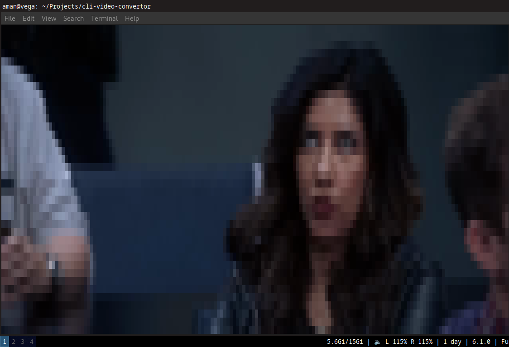

# CLI Video Player
Takes a video MP4 file and plays it in your CLI

## What it does exactly do?

1. Reads a video file
2. Extracts the audio & the frames - using [ffmpeg](https://www.ffmpeg.org/)
3. Reads the images, and turns them into terminal display using block of colors
4. Shows them at a default FPS with the audio running in the background

## Challenges & Future Scope:
1. Even trackpad movements interrupt the video
2. FPS and delays are not currently finetuned, video somewhat lags with the audio
3. Ship this as a standalone binary for all operating systems
4. Make the app accept FPS and resolution as command-line arguments
5. Export the displayable data into a file, so that we can run a file directly to play the video
6. Maybe use the traditional ASCII art instead of pixel blocks